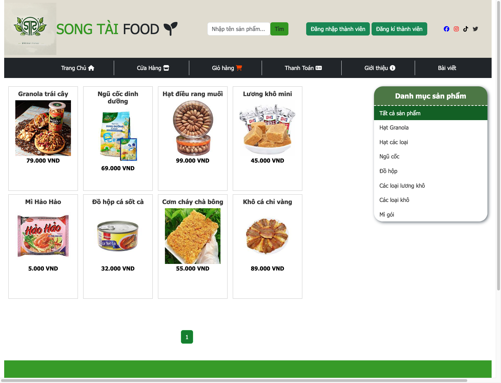

# Song Tai Shop - PHP Online Store

A legacy PHP and MySQL online store project built while learning web application development, then cleaned up and containerized with Docker for easier local setup and portfolio review.

The project focuses on practical e-commerce workflows: product browsing, authentication, cart and checkout, order tracking, articles, and admin management screens.

## Screenshots

### Home


### Store



### Admin Dashboard


## Tech Stack

- PHP 8.2
- MySQL 8
- Apache
- HTML/CSS
- Bootstrap
- JavaScript
- jQuery
- Docker Compose

## Features

- Product catalog and product detail pages
- Category-based product browsing
- Search by product name/description
- User registration and login
- Password hashing with `password_hash`
- Role-based admin access
- Shopping cart
- Checkout and order creation
- Order status tracking
- Article/blog pages
- Admin product management
- Admin order processing
- Admin statistics page

## Demo Accounts

```text
Admin
Username: admin
Password: admin123

User
Username: user
Password: user123
```

## Run With Docker

Start the application:

```bash
docker compose up -d --build
```

Open the customer site:

```text
http://localhost:8080/html/home.php
```

Open the admin area:

```text
http://localhost:8080/admin/admin.php
```

Open phpMyAdmin:

```text
http://localhost:8081
```

Docker database credentials:

```text
Host: db
Database: songtai_shop
Username: songtai_user
Password: songtai_password
Root password: root
```

Reset the database volume and re-import the seed data:

```bash
docker compose down -v
docker compose up -d --build
```

## Run With XAMPP/MAMP

1. Place the project in your local PHP server directory, for example:

```text
htdocs/php-online-store
```

2. Import the SQL file:

```text
database/songtai_shop.sql
```

3. Create local config:

```bash
cp config/config.example.php config/config.php
```

4. Update `config/config.php` with your local MySQL credentials.

5. Open:

```text
http://localhost/php-online-store/html/home.php
```

## Project Structure

```text
admin/            Admin screens for products, orders, articles, and statistics
class_models/     PHP classes for users, products, articles, admin, and control logic
config/           Database config and auth helper
css/              Custom styles and Bootstrap CSS
database/         MySQL schema and seed data
docs/             Git flow notes and screenshots
html/             Customer-facing pages
images_baiviet/   Article images
images_sanpham/   Product images and UI assets
js/               JavaScript and library files
```

## Database

The Docker setup imports:

```text
database/songtai_shop.sql
```

Main tables:

- `thongtin_nguoidung`
- `sanpham`
- `giohangnguoidung`
- `donhang0`
- `chitietdonhang0`
- `baiviet`

## Cleanup Notes

This was originally a hand-coded XAMPP learning project. Recent cleanup focused on making it safer and easier to review:

- Added Docker development environment
- Added seed database for reproducible setup
- Moved local DB credentials out of Git
- Added `config/config.example.php`
- Added `config/auth.php`
- Added admin role checks
- Changed product deletion from GET to POST
- Added safer JavaScript alert rendering with `json_encode`
- Added basic upload validation with `getimagesize`
- Escaped several admin outputs with `htmlspecialchars`

## Verification

Run PHP syntax checks inside the app container:

```bash
docker compose exec app sh -lc 'find admin class_models config html -name "*.php" -print0 | xargs -0 -n1 php -l'
```

Smoke-tested pages:

```text
/html/home.php
/html/store.php
/html/baiViet.php
/html/chitietsanpham.php?idsp=1
/html/chitietbaiviet.php?id=1
```

## Branch Workflow

This repository follows a lightweight Git Flow:

- `main`: stable code for release/demo
- `develop`: daily development branch
- `feature/*`: one branch per feature or improvement
- `release/*`: release preparation
- `hotfix/*`: urgent fixes from `main`

See [docs/git-flow.md](docs/git-flow.md).

## Notes

This project is a learning/portfolio project, not a production-ready e-commerce system. The goal is to demonstrate practical PHP, MySQL, CRUD workflows, authentication, admin management, Docker setup, and incremental cleanup of a legacy codebase.
